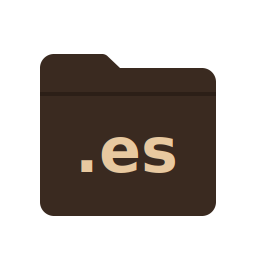

# docs-en-mi-idioma

> Traducciones al español de documentación técnica para la comunidad de habla hispana.

  

Un proyecto personal y comunitario para que la documentación de librerías open source sea accesible en español; sin importar tu nivel de experiencia ni dónde estés.

## Tabla de contenidos

- [Por qué traducir documentación importa](#por-qué-traducir-documentación-importa)
- [Flujo de trabajo](#flujo-de-trabajo)
- [Paquetes en traducción](#paquetes-en-traducción)
- [Paquetes traducidos](#paquetes-traducidos)
- [Cómo contribuir](#cómo-contribuir)
- [Apoya el proyecto](#apoya-el-proyecto)

---

## Por qué traducir documentación importa

El inglés domina el ecosistema open source. La gran mayoría de librerías, frameworks y herramientas publican su documentación únicamente en ese idioma; y eso tiene un costo real para quienes no lo dominan.

No se trata solo de un problema de idioma. Es una barrera de acceso. Cuando alguien no puede leer la documentación con fluidez, aprende más lento, comete más errores y queda fuera de conversaciones clave dentro de la comunidad. Para muchos desarrolladores en América Latina y otras regiones hispanohablantes, esa barrera está presente desde el primer día.

Traducir documentación técnica es una forma concreta de cambiar eso:

- Reduce la brecha de acceso al conocimiento tecnológico.
- Fortalece el ecosistema de desarrollo en LATAM y el mundo hispanohablante.
- Hace el open source más inclusivo: para quienes están aprendiendo a programar, para desarrolladores experimentados y para equipos en empresas.
- Reconoce que el talento no tiene idioma.

Este proyecto nació de esa convicción. La documentación debería ser para todos.

---

## Flujo de trabajo

El proceso es simple y reproducible:

1. **Fork** del repositorio original del paquete.
2. **Traducción asistida por IA** (Actualmente Claude, IA de Anthropic) como punto de partida.
3. **Revisión manual** para garantizar precisión técnica, tono natural y coherencia en la terminología.
4. **Pull Request** al repositorio original con la traducción propuesta.

La IA acelera el proceso; la revisión humana es siempre el paso final.

---

## Paquetes en traducción

| Paquete | Estado | PR | Notas |
|---------|--------|----|-------|
| [ansible-runner](https://github.com/ansible/ansible-runner) | En progreso | TBD | — |
| [bandit](https://github.com/PyCQA/bandit) | En progreso | TBD | — |
| [black](https://github.com/psf/black) | En progreso | TBD | — |
| [cookiecutter](https://github.com/cookiecutter/cookiecutter) | En progreso | TBD | — |
| [cookiecutter-django](https://github.com/cookiecutter/cookiecutter-django) | En progreso | TBD | — |
| [django-debug-toolbar](https://github.com/django-commons/django-debug-toolbar) | En progreso | TBD | — |
| [django-simple-history](https://github.com/django-commons/django-simple-history) | En progreso | TBD | — |
| [django-storages](https://github.com/jschneier/django-storages) | En progreso | TBD | — |
| [flake8](https://github.com/PyCQA/flake8) | En progreso | TBD | — |
| [freezegun](https://github.com/spulec/freezegun) | Esperando revisión | https://github.com/spulec/freezegun/pull/552 | — |
| [isort](https://github.com/PyCQA/isort) | En progreso | TBD | — |
| [ruff](https://github.com/astral-sh/ruff) | En progreso | TBD | — |

---

## Paquetes traducidos

| Paquete | Estado | PR | Notas |
|---------|--------|----|-------|
| [complexipy](https://github.com/rohaquinlop/complexipy) | Merged | https://github.com/rohaquinlop/complexipy/pull/147 | — |
| [responses](https://github.com/getsentry/responses) | Merged | https://github.com/getsentry/responses/pull/790 | — |

---

## Cómo contribuir

Este proyecto está abierto a todas las personas: contribuidores con experiencia en open source, desarrolladores que recién empiezan, equipos dentro de empresas, o cualquiera que quiera aportar su tiempo o conocimiento.

**Para sumarte:**

1. Abre un [issue en GitHub](https://github.com/jlariza/docs-en-mi-idioma/issues) para proponer un paquete, hacer una pregunta o reportar un problema.
2. **Comenta** en los PR existentes. Los desarrolladores de los paquetes no suelen darle importancia a las traducciones y suelen ignorar este tipo de PRs. Tu comentario demuestra que el PR es necesario y los incita a revisarlo y eventualmente mezclarlo. 
3. Si querés traducir un paquete, comentá en el issue correspondiente para coordinarnos.
4. Cuando existan, seguí las guías de contribución del repositorio original.
5. Priorizá la **claridad y el tono natural** por encima de la traducción literal.

**Principios de traducción:**

- Español neutro con preferencia LatAm.
- Conservar los términos técnicos en inglés cuando no exista un equivalente claro y establecido (por ejemplo: *commit*, *branch*, *render*, *hook*).
- Mantener consistencia en la terminología a lo largo del documento.

Todos los contribuidores serán reconocidos en este repositorio.

---

## Apoya el proyecto

Este proyecto se mantiene de forma voluntaria. Si te parece útil y querés apoyarlo, podés hacerlo a través de:

- **GitHub Sponsors:** [github.com/sponsors/jlariza](https://github.com/sponsors/jlariza) *(próximamente)*

- 

No es obligatorio ni esperado;  pero siempre bienvenido.

---

Licencia: [MIT](./LICENSE)
